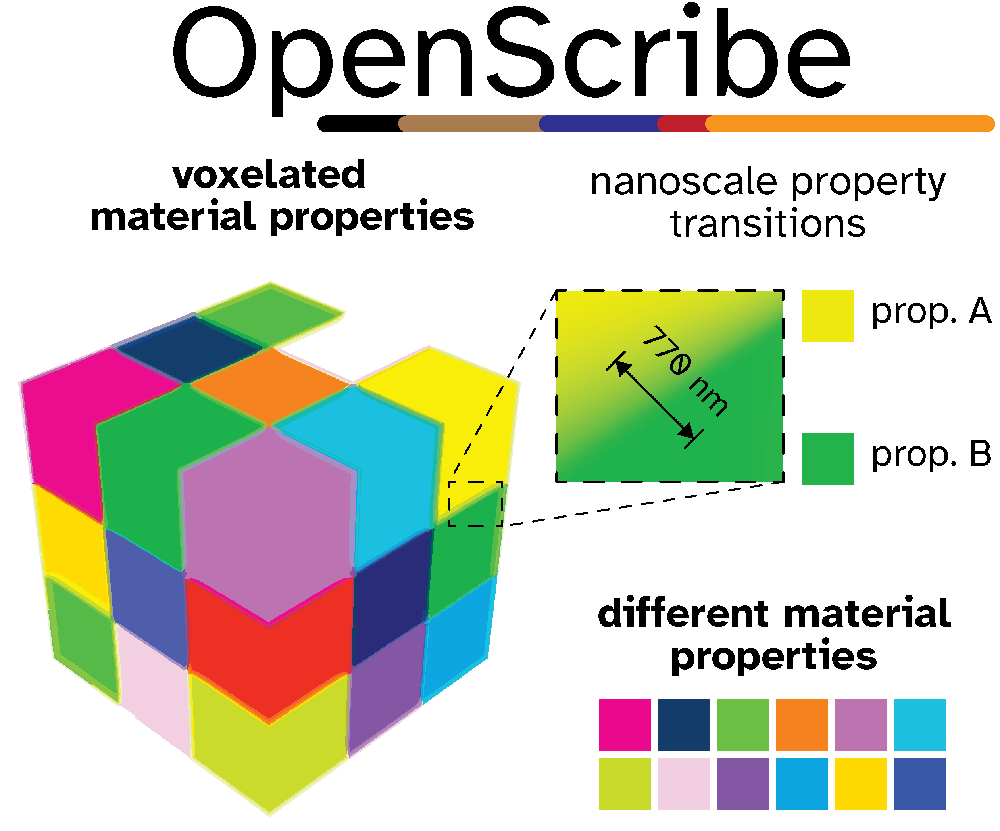

---

OpenScribe is free and open-source software for the design and simulation of 3D nanoprinted materials. Please contribute to the development of this software by  reporting bugs, suggesting new features, and submitting pull requests.

--- 

## 3D PRINTED MATERIALS WITH NANOVOXELATED ELASTIC MODULI
- Repo: https://github.com/peterlionelnewman/openscribe
- Paper doi: [10.1002/adma.202416262](doi.org/10.1002/adma.202416262)

Peter L. H. Newman, 2024, (peterlionelnewman @github)

As well, we'd love if you'd cite us if you use our script in any way :-)

### Abstract of paper
Fabrication methods that synthesize materials with higher precision and complexity at ever smaller scales are rapidly developing. Despite such advances, creating complex 3D materials with controlled mechanical properties at the nanoscale remains challenging. Exerting precise control over mechanical properties at the nanoscale would enable material strengths near theoretical maxima, and the replication of natural structures with hitherto unattainable strength-to-weight ratios. Here, we present a method for fabricating materials with nanovoxelated elastic moduli by employing a volume-conserving photoresist composed of a diblock copolymer hydrogel, along with OpenScribe, an open-source software that enables the precise programming of material mechanics. Combining these, we demonstrate a material composed of periodic unit cells featuring heteromechanically tessellated soft-stiff structures, achieving a mechanical transition over an order-of-magnitude change in elastic modulus within 770 nm, a 130-fold improvement on previous reports. Our work critically advances material design and opens new avenues for fabricating materials with specifically tailored properties and functionalities through unparalleled control over nanoscale mechanics.

---

### Installation
Install through a miniconda env, something like:

```shell
conda create -n openscribe python==3.11 pip
conda activate openscribe
git clone https://github.com/peterlionelnewman/openscribe.git
cd openscribe  
pip install -r requirements.txt
```

---

### Using OpenScribe
OpenScribe can be used:
1. either through the GUI (i.e. `python ./src/gui.py` after cloning the repo)
2. in a scripted manner by implementing scripts similar to those found in "./examples"

Further description of OpenScribes features are described in Table S2 - of the supplementary information of the paper

Creative Commons Attribution-NonCommercial 4.0 International Public License  - github.com/peterlionelnewman/openscribe/LICENSE

### Other
- PRs welcome
- An update to [pygfx][(https://github.com/pygfx/wgpu-py) - if theres enough demand

### Citation
Please cite us if you use this in any way!
- Newman et al., 3D Printed materials with nanovoxelated elastic moduli, Advanced Materials, 2025, [10.1002/adma.202416262](doi.org/10.1002/adma.202416262)
  
